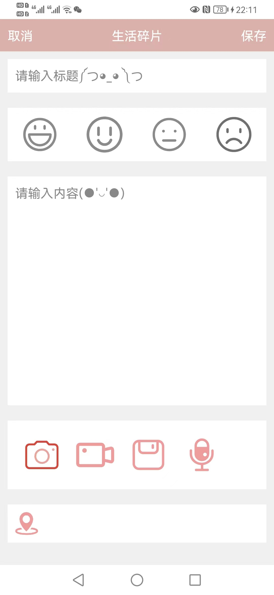

# LifeSlice

## The Repository

This repository is where I record my first work of HarmonyOS App development. Firstly, I used Axure RP to develop a rapid prototype of the electrical diary system. Then I used Java in DevEco Studio to implement the functionality of acquiring the mobile phone media resources such as camera photography, memory read/write, and geographic location, and I also built an object-relational mapping database to store data including user profile information, input diary content, and the acquired media content. In addition, DevEco Studio is not as smart and convenient as Android Studio, and there are not many references, so the development process needs some gradual explorations, and that's why I want it to be available to more people.

## Using
Developed an Android program using Java to control the player.  

      

Using IP addresses and port numbers to connect hardware and software, you can then select the music stored in the phone or the animations in the app to display, and of course you can choose the color of the LED lights.

## Editor
 

Developed a PC-side animation editor using Java  to realize frame editing of 3-D animation, you can choose any one of 3 axis to edit animation of each layer. Besides, you can select a color in the upper left corner and see a preview in the lower left corner.

  

Input files to the serial port directly using the pc controller.  

## Hardware
 

Used EasyEDA to design the PCB for the LED lights.  
Used C++ to complete functionalities of SoC serial communication, WiFi communication, LCD liquid crystal display menu, ADC keyboard keys, 128-point FFT, lamp brightness control etc. 

## Using
This project was my first system development work, and the hardware was also developed by myself. If you want to fully experience the project, you can contact me (fablerr@163.com) to get the PCB design drawing and contact the production yourself. On top of that, you'll need to solder 1,000 LED bulbs and countless latches. It sounds like a lot of work, but full-color light cubes are worth developing, at least in my opinion. Moreover, it's much easier when you have the hardware, you can download the software parts, I mean the App controller and the PC editor, and you can use them directly.

